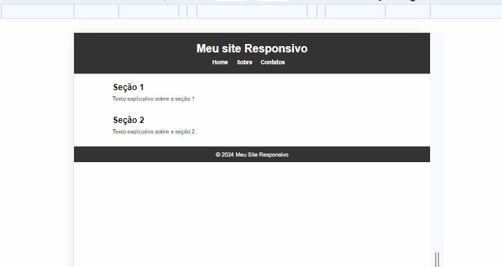

# Exercício para site responsívo em HTML e CSS - Estudo 

Um estudo pratico de responsívidade em CSS 👨🏻‍💻

[]

  
## Tecnologias utilizadas

- HTML
- CSS

### - HTML 
```
<!DOCTYPE html>
<html lang="pt-br">
  <head>
    <meta charset="UTF-8" />
    <meta name="viewport" content="width=device-width, initial-scale=1.0" />
    <link rel="stylesheet" href="style.css" />
    <title>Document</title>
  </head>
  <body>
    <!-- cabeçalho do site -->
    <header>
      <h1>Meu site Responsivo</h1>
      <!-- links de navegação. -->
      <nav>
        <ul>
          <li><a href="">Home</a></li>
          <li><a href="">Sobre</a></li>
          <li><a href="">Contatos</a></li>
        </ul>
      </nav>
    </header>
    <!-- Conteudo principal -->
    <main>
      <!--Seção 1 -->
      <section class="topic-section">
        <h2>Seção 1</h2>
        <p>Texto explicativo sobre a seção 1</p>
      </section>
      <!--Seção 2 -->
      <section class="topic-section">
        <h2>Seção 2</h2>
        <p>Texto explicativo sobre a seção 2</p>
      </section>
    </main>
    <!-- Rodapé do site -->
    <footer>
      <p>&copy; 2024 Meu Site Responsivo</p>
    </footer>
  </body>
</html>
```

### - CSS
```
/* Reset de estilos */
* {
  margin: 0;
  padding: 0;
}

/* Estilo para o corpo do site */
body {
  font-family: Arial, Helvetica, sans-serif; /*Define a fonte padrão*/
  line-height: 1.6; /*Espaçamento entre linhas*/
}

/* Estilo do cabeçalho */
header {
  background-color: #333;
  color: #fff;
  text-align: center;
  padding: 20px;
}

/* Estilos dos links de navegação */
nav,
ul {
  list-style: none; /* Remove os marcadores de lista */
}

nav ul li {
  display: inline; /* Exibe os itens da lista em linha */
  margin-right: 20px; /* Espaçamento entre os itens */
}

nav a {
  color: #fff; /* Cor do texto nos links de navegação */
  text-decoration: none; /* Remove sublinhado padrão dos links */
  font-weight: bold; /* Deixa o texto em negrito */
}
a:hover {
  color: #c5bdbd;
}
/* Estilo do conteúdo principal */
main {
  max-width: 800px; /*Definindo largura máxima do conteúdo principal*/
  margin: 20px auto; /* Centraliza o conteúdo */
}

/* Estilo das seções de tópicos */
.topic-section {
  margin-bottom: 30px; /* Espaçamento inferior entre as seções */
}

/* Estilo do rodapé */
footer {
  background-color: #333; /* Cor de fundo do rodapé. */
  color: #fff; /* Cor do texto no rodapé */
  text-align: center; /* Centraliza o texto */
  padding: 10px; /* Espaçamento interno */
}


```


